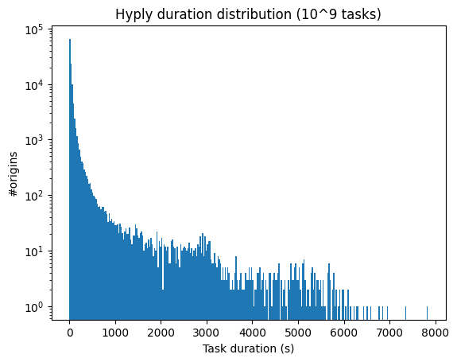
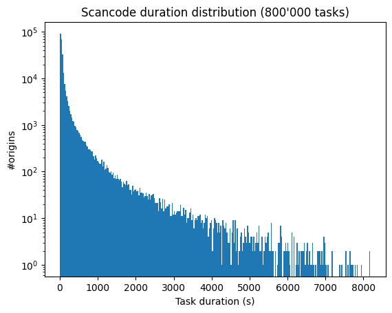
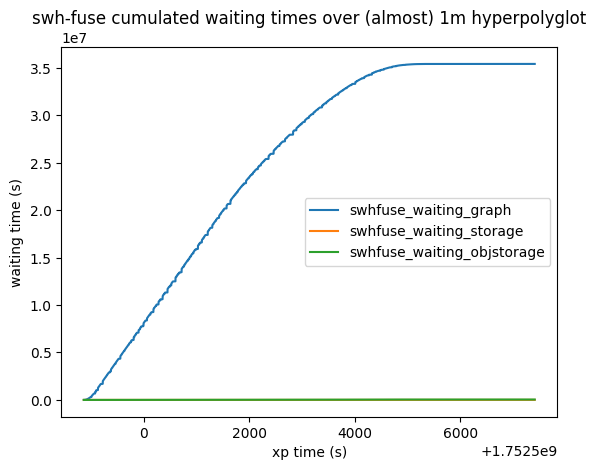
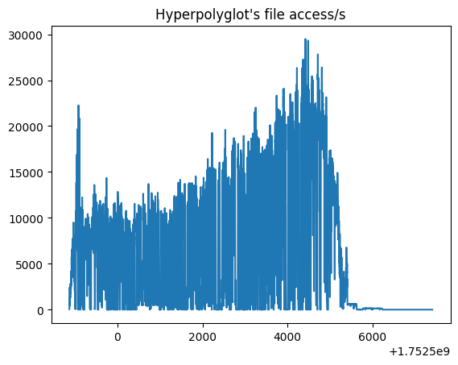
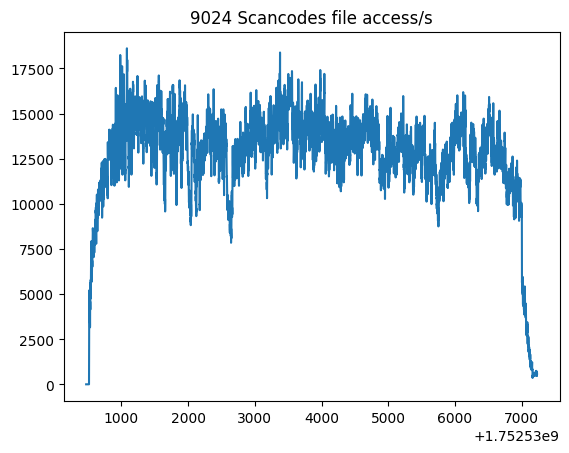
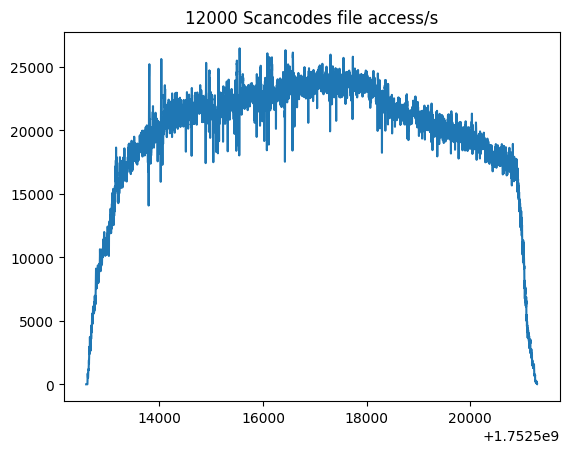
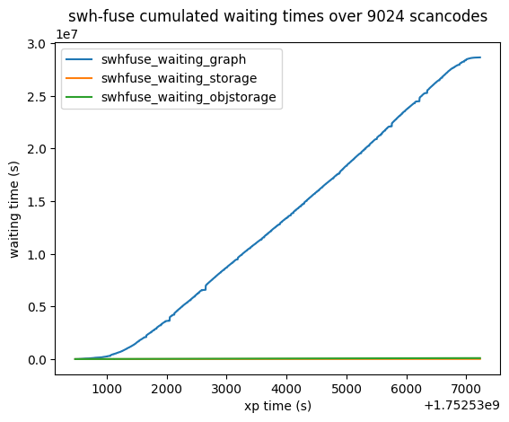
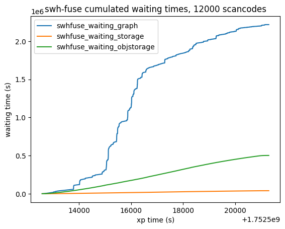

# swh-fuse scalability test over Kraken

_Martin Kirchgessner, July 18th 2025_.
_Thanks to Bruno Bzeznik and Pierre Girard for their support_.

The goal of [CodeCommons](https://codecommons.org/)' work packages on [code qualification](https://gitlab.softwareheritage.org/product-management/code-commons/-/issues/46)
is to perform programming language and license detection over the whole Software Heritage archive. That is over 400 million origins (one origin is equivalent to one git repository).
This document presents a benchmark realized on early July of 2025, as a preliminary experiment to assess the feasibility of this scan at a smaller scale: 1 million origins.

As part of [GRICAD](https://gricad.univ-grenoble-alpes.fr/)'s [new cluster test campaign](https://gricad.univ-grenoble-alpes.fr/actualites/2025/kraken/),
we could load-test [swh-fuse](https://docs.softwareheritage.org/devel/swh-fuse/index.html) to create from 8'000 to 16'000 mountpoints in parallel on 40 to 50 machines. Those instances are backed by an NFS objstorage, a node-local digestmap storage and a datacenter-local compressed graph: we try to reproduce, at a smaller scale, the future CINES installation that aims to perform archive-wide computations locally.


## 🐙 Setting

Hardware specs:
 * 50 computing nodes with 192 cores (2 AMD EPYC 9654 2.4GHz), 768 GB RAM (some have 1536 GB), 1.92 TB local NVMe SSD scratch
 * 300 TB BeeGFS distributed scratch filesystem (full NVMe SSD)
 * all of this very well connected via "Infiniband NDR 200 Gb/s HBA", by a hub that looks like a plastic octopus. Hence the cluster's name is [Kraken](https://gricad-doc.univ-grenoble-alpes.fr/hpc/kraken/kraken/).

Data mostly comes from [TheStackV2](https://huggingface.co/datasets/bigcode/the-stack-v2). More precisely:
 * Mountpoints' folder hierarchy comes from a [2024-12-06 compressed graph](https://docs.softwareheritage.org/devel/swh-export/graph/dataset.html#graph-dataset-2024-12-06), [served via gRPC](https://docs.softwareheritage.org/devel/swh-graph/grpc-api.html)
 * storage is provided by a [digestmap](https://docs.softwareheritage.org/devel/swh-digestmap/index.html#use-as-a-software-heritage-storage-backend) made from TheStack's listings (that contain, for each file, its `sha1` _and_ its `sha1_git` how cool is that?) so the whole folder weights only 112GB
 * objstorage contains all of TheStack contents, in an uncompressed `0:2/0:5` pathslicer, stored in the distributed scratch. This weights 58TB for 2.3 billion files.
 * TheStack also provides, for each file, its origin's root `swh:1:dir`, so we pick source folders randomly from that list.

Each machine picks randomly over a distinct interval of approximately 20000 root folders, consumed progressively by its processes. We tune the number of folders (ie., tasks) per machine such that the total is always 1 million.

We use 2 content scanners as experiments' payload:
* [Hyperpolyglot](https://github.com/monkslc/hyperpolyglot), one of CodeCommons' [benchmarked programming language detector](https://gitlab.softwareheritage.org/teams/codecommons/pli-benchmark/) - it's a Rust port of github-linguist, and is pretty fast indeed.
* [Scancode-toolkit](https://github.com/aboutcode-org/scancode-toolkit/) v32.3.3 running license detection ([--license](https://scancode-toolkit.readthedocs.io/en/stable/cli-reference/basic-options.html#license-option)).

Each instance is mono-threaded, because we're already running 200 tasks in parallel. Everything is installed via Nix flakes (available [here](https://gitlab.softwareheritage.org/martin/oar-deployments/-/tree/main/flakes?ref_type=heads)).

`swh-fuse` is almost v1.2.0, that is the first version with the ["hpc" dependency group](https://docs.softwareheritage.org/devel/swh-fuse/configuration.html#faster-file-system-traversal-with-a-local-compressed-graph)
(actually it's version [8bc9703](https://gitlab.softwareheritage.org/martin/swh-fuse/-/commit/8bc9703) from my fork: a version functionally equivalent to v1.2, but with additional metrics).


## 📝 Preliminary notes

Before jumping in architecture and figures, 4 observations that did not fit elsewhere.

### 0. We're not storing computations results (!)

All those experiments are made to measure how far we can parallelize our infrastructure.
Meanwhile, [the question of how do we store such results is still open](https://gitlab.softwareheritage.org/product-management/code-commons/-/issues/54).
So we just drop computations' results !
This speeds up our work a bit.

Only preliminary tests did log some results, to check that payloads are really working.

### 1. TheStack is not adapted to this

Although we used dir SWHIDs from TheStack listings, **84% queries to our storage (digestmap) raise an E_NOTFOUND**,
ie. payloads found only 16% of the files they wanted. TheStackV2 filtered _many_ contents from listed origins, even in the "full" dataset that contains 2,3 billion files.
**This is off-loading our objstorage artificially, and probably making payloads faster than they really are**.

Also, there's no such thing as a "full" dataset on HuggingFace. It's just a full list to download yourself from S3 ([as explained in the README](https://huggingface.co/datasets/bigcode/the-stack-v2#downloading-the-file-contents)).
We hold in GRICAD and SWH's private servers a copy of parquet files "with content", but it's only 530million files, _modified_ ! They anonymized those files because that's the subset they actually used for training - so these content do not match their sha1 (and [winery does not approve](https://gitlab.softwareheritage.org/teams/codecommons/github-ingestion/-/merge_requests/39#note_209565)).

This remark targets TheStackV2 but that probably applies to V1, too. **My suggestion is we should move away from TheStack and make our own sub-datasets of graph+contents**.

### 2. Origins are Unbalanced

This is a known property of the archive, verified when checking tasks' runtimes:

 

_Note: tasks may appear here to last zero seconds because of rounding_.


It is spicing our experiments a bit, because the cluster's scheduler restricts our experiments runtime
to `2 hours * 50 machines`. But some origins need more than 2 hours to be scanned.

### 3. zstd is nice, but xz makes archives smaller

While playing with contents it appeared that
compressing with `xz` is slow but small, according to my compression of `the-stack-v2-train-full-files` and to [Vincent who put the whole 58TB into 8TB archives](https://gitlab.softwareheritage.org/teams/codecommons/github-ingestion/-/issues/8#note_207356) - we both obtained 15-14% compression.


## HOWTO parallelize swh-fuse

So we have `swhfuse`, 50x192 cores, and a million repositories to analyze.
Let's discuss which back-end services are deployed and how they scale,
how scans are dispatched in a single machine,
then at the cluster level... which will impact back the in-node parallelization.

### SWH architecture in this cluster

The main change of [the freshly-released swhfuse 1.2.0](https://gitlab.softwareheritage.org/swh/devel/swh-fuse/-/tags/v1.2.0) is its ability to connect directly to Software Heritage's back-end services:
a graph, a [storage](https://docs.softwareheritage.org/devel/swh-storage/)
and an [objstorage](https://docs.softwareheritage.org/devel/swh-objstorage/).

#### All we need is one compressed graph server

In all experiments, one "fat" (ie. RAM-gifted) node is dedicated to serving a compressed graph over gRPC.
We only load forward edges and directory-relevant labels and properties (precise list is [in the swhfuse doc](https://docs.softwareheritage.org/devel/swh-fuse/configuration.html#faster-file-system-traversal-with-a-local-compressed-graph)) so it's using only 5.5TB. That still does not fit in our nodes' local storage, so this server is slowed by NFS accesses.
This may also explain why this server was constantly under-using its CPUs (see: last figures).

While writing this report
it occurs to me that maybe I should have copied "core" files (`graph.ef`, `graph.graph`)
in the local NVMe so it would have been faster... Maybe.

#### Storage is a node-local digestmap

`swh-fuse` only needs `StorageInterface.content_get()`
to find an object's `sha1` from its SWHID (`sha1_git`).


[swh-digestmap](https://docs.softwareheritage.org/devel/swh-digestmap/index.html)
has been implemented precisely for this.
It can be provided as an HTTP service (`swh storage rpc-server`),
but that does not scale well (hello GIL my old friend)
and I did not take time to check if there's a `--workers` option because:

The 2-billion-hashes hash-map fits in 113GB,
so each worker node copies it locally before starting anything.
Then `swhfuse` can sets the storage configuration to `cls: digestmap`,
so it will run `content_get()` in the same process.
Hopefully the kernel mutualize the mmap-ping between processes,
but we have not check.

#### Objstorage is good'old pathslicer over Hoyt

Hoyt is the 300TB-NVMe NFS who needed some testing too,
so we thought that writing 2.3b small files was testing enough.
That took 4 days.
As files are identified by their `sha1`,
we use a `0:2/0:5` pathslicer to dispatch them in folders.
This is mounted on all worker nodes behind `/hoyt`.

Note: by default Hoyt uses 512Kb blocks, but the write amplification did not hurt.
It just boasts the download rates on the monitoring interface.
We tried to move a subset in a 64K blocks subfolder,
but did not observe significant performance change.

### 🧪 in a node

We know beforehand that we'll traverse repositories only once,
so we completely disable swhfuse's on-disk caching.
Data sources are close anyway.

As we don't have enough permissions to FUSE-mount on these machines,
we must start `swhfuse` in a namespace,
with `unshare --pid --kill-child --user --map-root-user --mount`.
We can launch the scanner in that namespace...
but not necessarily, thanks to [a surprise feature of namespaced mounts](https://zameermanji.com/blog/2022/8/5/using-fuse-without-root-on-linux/#alternative-approach)
that let the user access a namespace's mounts from the outside.

We need at least one `swhfuse` mount, as you could have guessed.
A quick experiment, even on a laptop,
shows that a single mount cannot handle some/many scanners in parallel.
Multiple factors can explain this

 * FUSE architectures in general struggle at concurrency, because of the kernel-daemon
   communication and because many FUSE libraries add locks to ensure data stays coherent.
   cf. [Fuse and VFS locking](https://pyfuse3.readthedocs.io/en/latest/general.html)
   in the `pyfuse3` documentation.
 * we use `pyfuse3` who neatly provides async I/O support,
   but [they prefer Trio](https://pyfuse3.readthedocs.io/en/latest/asyncio.html) and I
   suspect the `asyncio` support could be improved (more on this in "Things we tried without success").
 * as always, python's [global interpreter lock](https://wiki.python.org/moin/GlobalInterpreterLock) makes your
   191 remaining cores sad.

So **we create one mount per running scanner**.
We force scanners to be mono-threaded,
and start with a number of parallel jobs equal to the cores count -
at least, because processes mostly wait.

Also, **we start a fresh mountpoint per scan**.
We could reuse mounts between jobs,
but they might leak memory over time and predicting `swhfuse`'s memory consumption is very hard
because predicting the scanning job's size is very hard (cf. the section on unbalancing above).
Even with one mount per job, we've seen a few `swhfuse` consuming 4GB of memory...
but those machines had much memory left so **this choice is questionable**.

Following those considerations, the first version of our experiments  launched a
[ProcessPoolExecutor](https://docs.python.org/3/library/concurrent.futures.html#concurrent.futures.ProcessPoolExecutor), iterating with a given number of processes over a given number of jobs
(ie. dirs to scan - around 20000).
Before scanning a directory,
each worker function [firstly created its mountpoint](https://gitlab.softwareheritage.org/martin/oar-deployments/-/blob/4bdf2df30ba351f12d0f5aefda20d6faf600741d/2025-06-17-bench1/krakenbench.py#L44)
with `Popen(["unshare --pid --kill-child --user --map-root-user --mount swh fs mount`.
That did successfully put a machine fully at work. And even 10 machines.

So we tried on 40:

### ⛈️ over the cluster

When starting the previous dispatcher over 40 machines (each running a
`ProcessPoolExecutor(max_workers=200)`), jobs simply did not start.
Or crashed with surprising stacktraces. Only a few machines managed to work.

It turned out that launching the above `Popen` 8000 times was causing a "stat storm",
that slowed down the start of `swh fs mount` - up to a few minutes each.
This is specific to Nix/Guix stores centralized over NFS,
and well explained in [this Guix article](https://guix.gnu.org/en/blog/2021/taming-the-stat-storm-with-a-loader-cache/).


### 🏭 back to the node-level: more fork() less execve()

Because of the stat storm, our new goal was to avoid as much as possible to start fresh `python` processes.
So we turned around the node-local parallelization, as follows:
 1. wrap the machine's main process with `unshare`
 2. make it import everything we need
 3. `fork()` for every task
 4. each fork calls `swh.fuse.fuse.Fuse.mount()` in its own event loop, in an OS thread.

With this strategy, each task still has to
 * `execve('fusermount3')`, because that's how `libfuse` works
 * `Popen()` its scanner process, because they're not always implemented in Python

So we still risk a stat storm.
After too many iterations, it turned out that the main offender was actually the step `2` above:
when using HPC-specific dependencies, `swh-fuse` pulls at least 600 modules.
Including 200 modules triggered by conditional imports
(in [graph_backend_factory and obj_backend_factory](https://gitlab.softwareheritage.org/swh/devel/swh-fuse/-/blob/master/swh/fuse/fuse.py?ref_type=heads#L302))
because we want to adapt to configuration.
Therefore,
if the main process does not mount
then it's missing those imports and then we had 200 forks trying to
make the remaining 200 imports at the same time.
That caused the stat storm.

Reproducibility note: other experiments listed 800 modules ([list here](https://gitlab.softwareheritage.org/martin/oar-deployments/-/blob/08413ff795b52d342222d3979e4855826dee1e78/2025-07-15-checkstatstorm/importlist.py#L8)),
my dev venv imports two thousands...

We ran [a small benchmark](https://gitlab.softwareheritage.org/martin/oar-deployments/-/blob/f794b5a/2025-07-15-checkstatstorm/) on a single machine:
using different methods to spawn 200 task processes, that only make their own temporary mountpoint.
Each application is traced by `strace -e %file -f -c` so we can count syscalls related to the stat storm,
including how many fail.

| Task is wrapped in... | Total `%file` calls |  Errors | wall clock time |
|--------------------|-------------|--------|----------------|
| `Popen(["unshare --... swh fs mount` | 2'284'890 | 473'309 |144s |
| `ProcessPoolExecutor` + [set_forkserver_preload](https://docs.python.org/3/library/multiprocessing.html#multiprocessing.set_forkserver_preload) | 117'217 | 35'364 | 10s |
| default `ProcessPoolExecutor` + pre-mount | 16'931 | 3'898 | 25s |

Although [forkserver](https://docs.python.org/3/library/multiprocessing.html#multiprocessing-start-methods)
is apparently the fastest variant of `ProcessPoolExecutor`,
the current [cluster experiments driver](https://gitlab.softwareheritage.org/martin/oar-deployments/-/blob/b772b1e79399f9dfb7f14211b83fa505289bf546/dahu-template/driver.py)
uses the last method: mount once, before starting a default `ProcessPoolExecutor`.


## 📈 NUMBERS 📉 FIGURES 📊 and HOT CPUs 🔥🧮🔥

About time !

This only shows successful large-scale experiments. Less successful experiments and raw data are stored in
[the "bench" branch of my fork](https://gitlab.softwareheritage.org/martin/swh-fuse/-/blob/bench/benchmark/README.md).

> **On the number of processes per machine**: We tried from 10 to 49 worker machines, each running from 192 to 350 processes. Results are coherent from 10 to 49 machines. The difference between 192 to 350 process in parallel is not much relevant: in all cases, we're mostly waiting for I/O... after 250 processes it seems we're slowing down everything. But this is too specific to this particular installation.

### Hyperpolyglot: ~1m origins in 2h

Using 40 machines that run Hyperpolyglot on 25000 dirs, dispatched 200 worker processes,
all but one machine had finished in less than 2 hours.

From a FUSE viewpoint,
Hyperpolyglot is so fast that it's like `grep`:
it's testing the pure performance of `swhfuse` over this cluster.
In this case, we're mostly waiting for the graph to provide repositories' folders.
This is expected because the graph is centralized on a single machine,
who's in turn waiting for the NFS to access its data.



The plateau at the last 2000 seconds of the experiment is caused by origins' unbalancing:
at that time, most worker machines are done and we're only waiting for the very last
and very long tasks.

It seems that these task also trigger a new behavior of hyperpolyglot,
that tries to read more files (figure below).
_But_ this figure only counts files successfully read -
82% attempts at `open` did fail because TheStack did not include the required content...
so maybe the final increase happens only because we got lucky and could open more files in those "deep" origins.



### Scancode: almost 100 license reports per second

Scancode is known to consume more CPU per task.
So we ran more concurrent processes per machine,
under the assumption that
while some processes are waiting for I/O, others might use some CPU.
Scancode also reads more files: in our experiments in tried to open 3 to 4 times more files than Hyperpolyglot -
but, again because of TheStack's filtering, 84% of those read did fail.
In all cases, as with hyperpolyglot, the computation time of the storage layer (digestmap) is negligible so we do not report it below.

| #Processes | Runtime (1) | #Origins analyzed | Origins/s |  Avg. task time | Avg. waiting for graph | Avg. waiting for objstorage | Avg. files open/s |
|-----------|-------------|-------------------|-----------|-----------------|------------------------|-----------------------------| ---------------- |
| 47 machines * 192 = 9024 | 1h53 | 522'750   |  77       |    86s          |  55s                   | 0.2s                        | 12'625 |
| 40 * 300 = 12000 | 2h25    | 814'187        |  93       |     93s         |  2.7s  (2)             | 0.6s                        | 19'770 |
| 49 * 300 = 14700 | 1h50    | 660'474        | 100       |    115s         |  78s                   | 0.3s                        | 15'070 |
| 47 * 350 = 16450 | 1h53  | 695'000          | 102       |    122s         |  87s                   | 0.15s                       | 12'437 |

_(1) that is, after node setup (downloading the digestmap) and before we're interrupted by the scheduler's wall time. We could not wait for all processes' completion_.

Point (2) is surprising because it's the only unusual metric for that experiment, so it's unlikely a measurement error.
Another hypothesis comes from Grafana figures below: during that experiment, we were using the NFS almost lonely.
Our usernames are `kirchgem` _and_ `root`, because tasks are running as root in their namespace, tricking the monitoring.
This allows us to distinguish between NFS reads because of the graph (made as `kirchgem`)
and reads targeting the objstorage (made as `root`).
These figures also highlight how important it is for the graph to have its files locally.

This is an extract from the NFS monitoring during the fastest (12000 processes) experiment:


Below is the same monitoring, during two other experiments
where swhfuse was much more waiting for the graph:


So concurrent accesses to the NFS may have slowed down the graph server even more.

Overall, the NFS managed to provide _many_ objects per second:

 

Among the 3 "external" services, `swh-fuse` was again mostly waiting for the graph server -
but when it's fast, the objstorage starts to show up:

 

The experiment on 12000 processes, happening under the best conditions,
also traced the nicest CPU use:


RAM measures for the same experiment:


## Things we tried without success

### Free-threading

Since v3.13, Python exists in a [free-threading](https://docs.python.org/3.13/howto/free-threading-python.html)
variant,
where the GIL is disabled.
Can it allow us to use a single mountpoint per node,
that could use more than one core to work on all those I/O requests? Not yet.

The first problem is that v3.13t has a 40% overhead, according to its documentation.
This should be much lower in v3.14t, but this one is not supported by PyO3 yet.

The second problem is that [native extensions should be adapted](https://docs.python.org/3.14/howto/free-threading-extensions.html) to free-threading,
and pyfuse3 has very few chances to ever be.

As the current implementation of `swhfuse` already contains many calls to
`loop.run_in_executor`, that start tasks in a thread,
we built a 3.13t venv to check if that does spread threads across cores out of the box.
That does not.
In particular, when using the WebAPI back-end swhfuse still blocks during its requests.
We have no explanation so far.
As [PYfuse3 recommends Trio](https://pyfuse3.readthedocs.io/en/latest/general.html),
my hypothesis is that its asyncio support is less reliable.

### Pre-loading (with get_batch in mind)

One variant of `swhfuse` is able to pre-load objects, it still exists
[in a branch in a fork](https://gitlab.softwareheritage.org/martin/swh-fuse/-/tree/preloading?ref_type=heads).

It also suffers from blocks during requests,
and in this case it's a show-stopper because it makes many requests by itself:
its strategy is that once someone opens a folder,
it starts caching all its files' contents,
possibly filtered by extension.
This sounds intuitive, especially as it could use `ObjStorage.get_batch()`
(and `Storage.content_get()` first, but that's batch-able too).

However, it does not fit payloads' access patterns at all:

 * hyperpolyglot and scancode (it's been confirmed by [Coccinelle developers](https://coccinelle.gitlabpages.inria.fr/website/), too) start by traversing the directory tree,
 then backtrace to read files, and prune branches as most as possible.
 * some scanners try to avoid opening everything, or do not read complete files:
   we would probably download too much.
 * it would be very hard to predict the correct pre-loading order,
   and most of the time the user program will attempt to open much faster than we'll be able to preload.
   So we would need a kind of pre-emption of the pre-loading order, that would add a complexity layer on the existing cache lasagna.

As shown in Scancode experiments,
when scanning the whole archive a much more simple way to increase the throughput is
to compensate the time spent waiting for back-end services
by running many payloads in parallel, more than available cores per node.

## What next ?

### ❄️ Flakes or containers 🐋 ?

This is a bit specific to the GRICAD premises, but might hurt elsewhere:

1. the SWH stack is heavy on dependencies: one naively runs `pip install swh.fuse[hpc]` and `swh fs mount`, and without notice gets a python process that has loaded almost _one thousand_ non-trivial Python modules. And that yak will be hard to shave.
2. Nix flakes are too hard to update. The amount of dependencies does not help, neither does Nix's habit to run tests, which slows down installs and may crash irrelevantly. For example, I can't update swh-fuse's `flake.lock` on Kraken because it would break some test over the cassandra backend 🤷

These problems call for containers, but such container might be bloated too and is not adapted to all premises (like, CINES).
Please send opinions and arguments on that matter!

### 🦺 Beware of libfuse and its bindings

`swh-fuse` was implemented 5 years ago, using [pyfuse3](https://github.com/libfuse/pyfuse3).
It is a binding to `libfuse`, and they both introduce their source with a big warning:
[they're both not actively maintained](https://github.com/libfuse/libfuse?tab=readme-ov-file#development-status).
Therefore it's hard to predict what will happen or how long we'll be able to compile.
`pyfuse3` is not the only binding,
but for example [python-fuse](https://github.com/libfuse/python-fuse) is less concurrency-oriented.
And, as discussed in "Things we tried without success",
all these bindings won't let us benefit from the fact that we're read-only.

We could have a lock-free binding.
If we ever want to reach for more performance, that could be a better option than, for instance:

### 🦀 "Rewrite it in Rust"

Any language will hit the problem above, and the fundamental FUSE flaw: the relationship between the kernel and FUSE daemons is weird, prone to deadlocks and bad at juggling with concurrent calls.

Compared to a local clone, surely the current `swhfuse` is slowing down computations. But how much compute and I/O does it takes to reconstruct a local clone from the archive? In our setting, we're mostly waiting for other services (graph, storage, objstorage) or waiting for the payload to do something with given files. I would not bet that a Rust implementation would perform significantly better, even at `grep` (or Hyperpolyglot) and most payloads are (much) more cpu-consuming.

Rewriting is also not trivial: porting [all configuration options](https://docs.softwareheritage.org/devel/swh-fuse/configuration) would pull many threads.

### 📦 Creating standalone shards and/or teaser shards

It's nice to have a "teaser graph" like `2023-09-06-popular-1k`,
and in the process we published its digestmap (`s3://softwareheritage/derived_datasets/2023-09-06-popular-1k/digestmap/`).
But it's still hard to access its content: this graph refers to 64 million objects that weight 3TB,
but TheStackV2 only intersects 330GB of these.

We now have [stand-alone shard files](https://gitlab.softwareheritage.org/swh/devel/swh-shard)
and even [configurable primary hashes](https://gitlab.softwareheritage.org/swh/devel/swh-objstorage/-/merge_requests/222), therefore with David we lured writing incredibly self-contained `swh-fuse` configs like

```
    cls: soloshard
    primary_hash: sha1_git
    path: /path/to/shard
```

that could ease significantly the archive reuse! And skip the digestmap entirely 🌈.

### 🚢 Ship "parallelized swhfuse" tooling

We should include in the swhfuse package (and documentation) some helpers to parallelize locally,
because that would amortize their development and could save much time to end-users.
They probably don't want to find
the [weird](https://gitlab.softwareheritage.org/martin/oar-deployments/-/blob/f794b5a/2025-07-15-checkstatstorm/mountinthreadautopreload_run.sh?ref_type=heads)
[hacks](https://gitlab.softwareheritage.org/martin/oar-deployments/-/blob/f794b5a/2025-07-15-checkstatstorm/mountinthreadsimple.py?ref_type=heads)
that allow a reasonably-efficient multi-processing.

### 🚀 Run at CINES

These experiments teach three important lessons:

 * install the whole `swh-fuse` stack _locally_ (in a container, on the system...)
 * the node hosting the graph should work locally too. Which means "put it in a machine having >6TB storage" (or, copy the most graph files you can locally).
 * then it's all about how the objstorage can handle 20k reads/s 🍿

The last point is probably the most important.
Because the 20k/s measured here come from the 16% of successful `open()` attempts ; others were quickly (locally) blocked by the digestmap.
In a real setting, all files would be available so maintaining the payloads' rates shown above would pull 5 times more.

Standalone shards might help here too.
[sux.func.VFunc](https://docs.rs/sux/latest/sux/func/struct.VFunc.html) (the structure really working behind `swh-digestmap`) could, _for the complete archive_, materialize a `shard_id(shwid)` function in a structure weighting a bit more than 100GB. This could be copied on all nodes, so they could know locally which shard (accessible over a NFS) contains each object.
That might scale better [than Winery](https://wiki.softwareheritage.org/wiki/Winery_Object_Storage_Benchmarks#Developing_the_benchmark_software_and_report) in a read-intensive situation.
