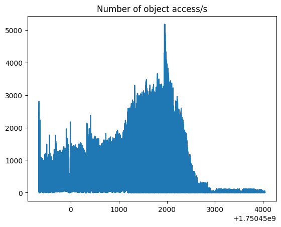

# 2025-06-26 Erratum on detecting languages in TheStackV2, over 2000 mounts in parallel

In the previous experience (section 2025-06-20 below) an unlucky configuration blocked hyperpolyglot from actually reading any file
(although each file was downloaded to the worker node) and it still managed to guess languages !

In the meantime we added a few other metrics, and managed to have Scancode almost running, so here are some numbers.

## How bad is origins unbalance ?

Very bad, much Zipf, wow:

## What is swhfuse waiting for ?

Mostly for the graph, **BUT**
 * the average Scancode task lasted 131s, including 0,8s waiting for the graph
 * the average Hyperpolyglot taks lasted 22s, including 0,2s waiting for the graph

so swhfuse causes a fairly small time penalty, after all.

# 2025-06-20 Detecting languages in TheStackV2, over 2000 mounts in parallel

## 🍿 SWH architectural take-aways

 * `swh-fuse` itself is still as slow you can expect from a python-based FUSE, but it's still mostly waiting:
 * `swh-graph-grpc-server` latency could be better if it was hosted on a machine with enough storage to hold its files locally (5.5TB), and that could make a difference.
 * then it's all about how much thoughput can be expected from storage/objstorage
 * node-local digestmap is very fast, and for the complete archive could allow to bypass the storage layer if we have ~1.5TB storage on worker nodes.

## 🏭 Setting

As part of [GRICAD's new cluster test campaign](https://gricad-doc.univ-grenoble-alpes.fr/hpc/kraken_freeride/),
we could run [swh-fuse](https://docs.softwareheritage.org/devel/swh-fuse/index.html) at the unprecedented scale
of 2000 mounts at once over 10 machines backed by a single, local objstorage and compressed graph.

Hardware specs:
 * 10 computing nodes with 192 cores (2 AMD EPYC 9654 2.4GHz), 768 GB RAM, 1.92 TB local NVMe SSD scratch
 * 1 "fat" node - same as above with 1536 Go RAM - hosting [swh-graph-grpc-server](https://docs.softwareheritage.org/devel/swh-graph/grpc-api.html)
 * 300 TB BeeGFS distributed scratch filesystem (full NVMe SSD) - hosting the objstorage
 * all of this very well connected via "Infiniband NDR 200 Gb/s HBA"

Data:
 * [2024-12-06 compressed graph](https://docs.softwareheritage.org/devel/swh-export/graph/dataset.html#graph-dataset-2024-12-06), stripped to forward-only connections and directory-relevant labels and properties (precise list is [in the swhfuse doc](https://docs.softwareheritage.org/devel/swh-fuse/configuration.html#faster-file-system-traversal-with-a-local-compressed-graph)) so it's using only 5.5TB - we only traverse 200k origins' root directory anyway.
 * storage is provided by a specific [digestmap](https://docs.softwareheritage.org/devel/swh-digestmap/index.html#use-as-a-software-heritage-storage-backend) made from TheStack's listings (that contain, for each file, its `sha1` _and_ its `sha1_git` how cool is that?) so it weights only 112GB
   - in a preliminary experiment this was hosted behind a `storage rpc-serve`, one instance per worker node, using tables on the distributed scratch. This turned the storage instance into a bottleneck because it was a single thread. therefore:
   - results below use a machine-local copy of the digestmap, accessed directly by `swh-fuse` via the Python module. So far we cannot assess how much more CPU this consumes per `swh-fuse` process, but results suggest it's fast enough.
 * objstorage contains all of TheStack contents, in an uncompressed `0:2/0:5` pathslicer over the distributed scratch. Writing those 2.3 billion files took 4 days, averaging at over 8300 files written per second, and should weight 58TB  (I did not dare to `du -sh`).
 * TheStack also provides, for each file, its origin's root `swh:1:dir`, so we pick source folders randomly from that list.

 **Each machine is dispatching 20'000 root folders among its 200 processes: as we have 10 worker nodes, results below represent batches of 200k distincts origins. We ran 2 batches to compensate the randomization** and the two batches gave coherent results. Each node is picking randomly in a distinct origins interval.

Software:
* Payload is [Hyperpolyglot](https://github.com/monkslc/hyperpolyglot), one of CodeCommons' [benchmarked programming language detector](https://gitlab.softwareheritage.org/teams/codecommons/pli-benchmark/) - it's a Rust port of github-linguist, and is pretty fast indeed. It was picked for this first ride because it's really doing something, but quickly enough to be really demanding towards swh-fuse (as opposed to Scancode, who was meanwhile blocked trying to cache things in its nix-installed source folders). Each instance is mono-threaded because we're already running 200 in parallel.

* Everything is installed via Nix flakes (available [here](https://gitlab.softwareheritage.org/martin/oar-deployments/-/tree/main/flakes?ref_type=heads)).
   - as we don't have anough permissions to FUSE-mount on these machines, we rely on [a surprise feature of namespaced mounts](https://zameermanji.com/blog/2022/8/5/using-fuse-without-root-on-linux/#alternative-approach).

* `swh-fuse` is almost v1.2.0. Actually, it's [3324f60](https://gitlab.softwareheritage.org/martin/swh-fuse/-/commit/3324f60) from my fork, that is functionally equivalent to v1.2.0 but does not require an update of `swh-core` which is a bit too hard to negociate with Nix.

The [swh-config.yml is here](https://gitlab.softwareheritage.org/martin/oar-deployments/-/blob/main/2025-06-20-bench2/config.yml?ref_type=heads).
Detailed scripts, log and measures are now
[in a dedicated repository](https://gitlab.softwareheritage.org/martin/oar-deployments/-/tree/main/2025-06-20-bench2?ref_type=heads)
because many things are specific to OAR-driven clusters.

Thanks to Bruno Bzeznik and Pierre Girard for their support during that ride.

## ⚠️ Biases

 * there's _much_ external activity on the distributed scratch: sustained multi GB/s read/writes by other users. That can slow down the objstorage or (as we'll see) graph access.
 * not sure if mounting in a namespace and accessing it via `/proc` impacts performance
 * TheStackV2 filtered _many_ contents from listed origins - **75% queries to our storage (digestmap) raise an E_NOTFOUND! This is off-loading the objstorage artificially.**

## 📈 Key result: ~10 origins/second/machine

On average, analyzing one origin took 36s, including
 * ~0.5s waiting for digestmap
 * ~5s waiting for objstorage
 * ~37s waiting for the graph,

Those numbers add up to more than the average duration... probably unbalanced by the 3 short periods when processes had to wait for the graph for a _long_ time - ie. when the blue bars below are almost vertical:

## 🔍 Detailed results

At the very beginning, starting 200 FUSE mounts at the same time causes a weird load peak on worker nodes (during less than an minute). We could probably start more per machine, but should take care of shuffling their start time.

We could analyze 200000 origins' roots over 1h and 77s, which averages at more than 5 origins/s/machine, but half of the time most machines were not working any more because of origins unbalancing: the "fastest" (read: lucky) 4 machines finished their whole batch at more than 10 origins/second on average. The second batch even lasted 1h and 20 minutes, because one process was working alone for half an hour.

On a larger scale, we should be able to compensate this unbalancing by dispatching many origins over many machines over a longer time, so it's reasonable to measure the throughput after the starting peak and before the first machine has finished its batch - hence the "10 origins/s/machine" rule of thumb.

Looking at `htop` during the experiment:
 * on workers: htop shows almost 200 load, but less than 1% of CPU per hyply and less than 20% per swhfuse process. swh-fuse are very often in the `D: Uninterruptible sleep` state, ie. waiting for I/O.
 * on the graph server:
    - CPU load had a small peak (62 load / 800% CPU) when starting, then cruising around 200-400%CPU but system load averages around 8 so it might be waiting for the scratch FS too.

We have a Grafana board showing activity on the distributed scratch FS. This shows access rates per user, and because FUSE is mounted as root the board is giving a figure for `root`, that allows to distinguish pure objstorage access, from graph access done by my own account `kirchgem`. This shows that objstorage is reading at a steady 1.5GB/s during the "cruise" phase, although that's only 25% of files that hyperpolyglot would like to read... The successful reads rate evolves as follows:

For much more details, see `2025-06-20-bench2-take{1,2}.ipynb`

## ❓ RFC

it would be cool to...

* release [statsd_to_parquet](https://gitlab.softwareheritage.org/swh/devel/snippets/-/blob/master/martin/statsd_to_parquet.py?ref_type=heads#L165-179) on PyPI because I can't be the only one to prefer storing statsd events in parquet files instead of spawning the whole Grafana zoo
* release/document swh-fuse mounted as a Python context manager (aka [SwhFuseContext](https://gitlab.softwareheritage.org/martin/oar-deployments/-/blob/main/2025-06-20-bench2/krakenbench.py?ref_type=heads#L47-51)), because it's nicer when mounting 200 times on a system that does not really allow FUSE to your user

## 👀 Soon

as in "hopefully in the next 2 weeks"

* tracking each payload's runtime, for the fun of observing the origins' size unbalance.
* same setting running Scancode, because since this experiment I found the environment variable `SCANCODE_LICENSE_INDEX_CACHE` that can avoid Scancode trying to write in nix-forbidden source folder.
* scancode and hyperpolyglot over 1m origins over the whole cluster: 50 worker nodes so 10000 processes 🚀

# 2025-04-14 First 100% local swh-fuse on python-popular-500k

## Setting

Very similar to the 2025-03-11 bench (see below), but we added
 * a [digestmap](https://gitlab.softwareheritage.org/swh/devel/swh-digestmap/-/merge_requests/3), read via the Python binding, able to map locally SWHIDs to SHA1 for contents in this graph
 * a third test case with [hyperpolyglot](https://github.com/monkslc/hyperpolyglot) a language detector implemented in Rust (it's fast!),
   hopyfully slower than counting Python LOC in Python but faster than Scancode

## Results are OK

Detailed results are in `.ods` in benchmark folders:
[folder1](https://gitlab.softwareheritage.org/swh/devel/swh-fuse/-/tree/bench/benchmark/2025-04-10?ref_type=heads)
[folder2](https://gitlab.softwareheritage.org/swh/devel/swh-fuse/-/tree/bench/benchmark/2025-04-14_nocache?ref_type=heads)

* in that setting most of the "cold fuse" overhead is spent waiting for the `graph-grpc` server (even locally), which is expected as it's the most complex service in the stack
* Scancode is so slow (even running only `--licence`) that there's no significant difference between FUSE/vault
* a first access via FUSE takes ~50 more times than the computation itself
  + variance is non-negligible: on that grade minimum is 6 times longer, maximum 200 times longer... but all this is sub-second
* Hyperpolyglot is a bit faster than our Python lines counter 😅 and it's multi-threaded so we're not reporting FUSE's waiting times correctly in that case
* Even on cold start, running cases via fuse is vaguely 5 times faster than downloading from the vault (but it's much much farther away)

## Should we cut swh.fuse.cache ?

Also ran a bonus variant, [removing `swh.fuse.cache`](https://gitlab.softwareheritage.org/martin/swh-fuse/-/commit/ebcac8b2b3f869bda48a8908e957a5a4de321dac)
Granted, that module provides a fancy configurable cache - but it's deeply intricated in
the implementation, and forces all meta-data through a JSON (de)serialization. What
happens if we remove it entirely ?

Note that this comparison was not made as consecutive runs on the same content with/without cache, but as a second batch running against the vault again.
So numbers below still use the uncompressed vault archive as a baseline.

* Hyperpolyglot (who's multi-threaded) was 56 times slower on cold-FUSE / 13 times when cached
  + without the caching module, it's 17 times slower, 4 times when cached
* PythonLOC counter was 53 times slower, 10 times when cached
  + without the caching module, it's 50 times/ 10 times when cached
* Scancode is too slow

so it is a bit faster, but
 * `swh.fuse.cache` still provides a configurable, potentially persistant, cache, which is
still relevant for WebAPI users - that is, people developping FUSE traversers.
* in the final setting nothing will be local, so FUSE will spend most of its wall-clock time waiting for distant services anyway

so let's keep that cache, it's time to run a full-scale test.

# 2025-03-11 First test of swh-fuse with a local graph+objstorage

## TLDR just give me numbers

We're reaching reasonable runtimes, even on cold start.
However waiting for the distant `storage` still accounts for 70% of the `swh-fuse` overhead.

When runnning ScanCode, `swh-fuse` takes only 10% more time on cold start, 0.7% more once filled.

When counting lines in `*.py` files, `swh-fuse` is 500 times slower on cold start, and 10 times slower with a pre-filled cache but maybe that's still unfair because the baseline has an NVMe.

## Setting

Running [swh-fuse@connecttoobjstorage](https://gitlab.softwareheritage.org/swh/devel/swh-fuse/-/merge_requests/95)
on `ddouard-desktop` because it has locally
 * an objstorage covering the `popular-python-500` graph (pathslicer over a hard drive).
 * a local compressed graph gRPC server (on popular-python-500)
 * connecting to `storage-ro.internal.staging.swh.network` (average RTT: 10ms)

In other words, FUSE is not contacting the WebAPI any more.

Two tests case, running over randomly picked releases among `popular-python-500`:
 - 100 runs of `scancode -clpieu` (ie. extensive analysis)
 - 100 runs of counting (in python) python lines of code

The first case is largely dominated by the computation itself,
whereas the second is pulling from `swh-fuse` as fast as it can.

Each run consists of
 * a vault download of said release - run is aborted if vault failed, because the case's runtime over the untarred folder is considered as baseline (however it's untarred to /tmp who's in an NVMe which is not fair, but I notice this as I'm writing the report. Harder conditions yield stronger modules, maybe)
 * running case over `mountpoint/archive/[releases' root]` , which we call "cold FUSE"
 * running the case again, this time we only hit our cache so it's "hot FUSE"

We put all swh-fuse caches in memory, and reset them after each pass so the cold run is really a cold start.

## Notes

 * `swh-vault` returns many 404 - ~40% failed on scancode case, 70% on python SLOC.
 * I remove 3 `scancode` runs because computation time went astray when running over the vault (although the vault replied as quickly as usual 🤔)

## Very soon

 * a third case using a middle-ground computation, [hyperpolyglot](https://github.com/monkslc/hyperpolyglot)
 * measuring memory consumption

## Soon

* using a local hashes map instead of calling `storage`
* playing with `swh-fuse` cache parameters, and removing its cache entirely because it's serializing so much to JSON.

# 2025-01-25 Quick'n'dirty fwh-FUSE benchmark

## Test cases

 * Counting Python SLOCs: glob `**/*.py`, open each file (in Python), count lines.
 * Counting Python files: glob `**/*.py`, count resulting files. This one does not access files' content, so it should be the fastest.
 * Scancode: `scancode -clpieu --json-pp [swhid.json] [swhid]` ie. a pretty complete report.

## Measures

For each SWHID we measure 4 runtimes:

* **vault** downloads the directory from the archive, untar locally, runs the test.
* **baseline** is vault without the download/untar time, ie. measures how much time takes the case to run in a purely local setting.
* **cold FUSE** launch the case on `mountpoint/archive/swh:1:dir:...` - during this first run, `swh-fuse` has to make *many* calls to the SWH Web API (one per traversed inode).
* **hot FUSE** launch the same case again: this time `swh-fuse` should have everything in its cache, so this measures FUSE's overhead

## Results summary

"Cold FUSE" is so slow (up to 7h on a single release folder) that it limits the number of cases we could run: 4 for ScanCode, 2 SLOC counts, 16 files counting... and its cache is not remembering everything by default.
"Hot FUSE" is much faster, and its logs confirm it almost does not make any API query. In other words, the bottleneck of cold FUSE is API calls, as expected.

For a complex task like ScanCode, vault does not add much overhead, below 4%.
Hot FUSE is on par with local FS, and does not uses much CPU while ScanCode runs (less than 3s of CPU time while ScanCode took 80s).

Complete results are in `results.ods` in this folder.

## Method and potential biases

We pick SWHIDs randomly from the 12315 releases in
[2021-03-23-popular-3k-python/compressed/graph.nodes.csv](cf. https://docs.softwareheritage.org/devel/swh-graph/quickstart.html#retrieving-a-compressed-graph).
Randomness should ensure that the server side does not benefit from any cache...
but as there is only ~1200 origins, we can likely encounter some contents again during those tests.
The vault only works on directories,
so revision IDs are converted -
see `origins_to_directories.py` for the preparation step.
Restricting to Python releases may introduce biases, but we have to pick SWHIDs somewhere
and working on that dataset can allow us to later compare locally to a graph-based implem.

`bench.sh` helps to tidy up CSVs and related log files.
We use a custom logging configuration, to have `swh.fuse` in DEBUG with timestamps.
